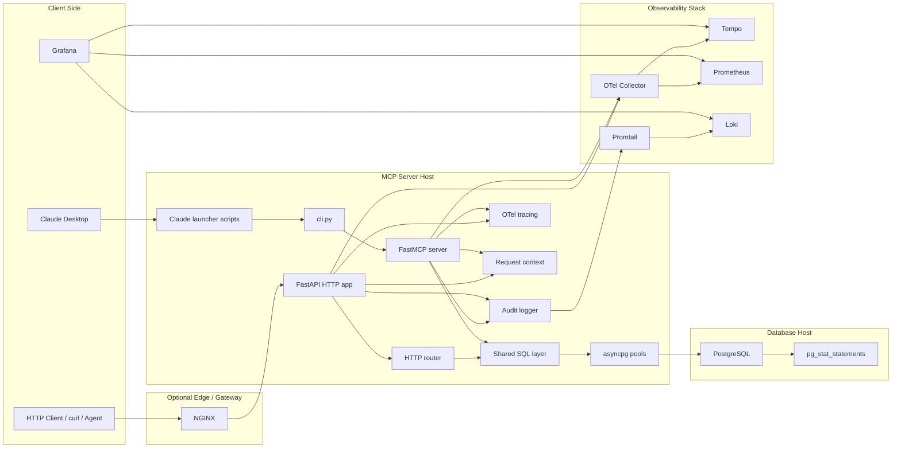
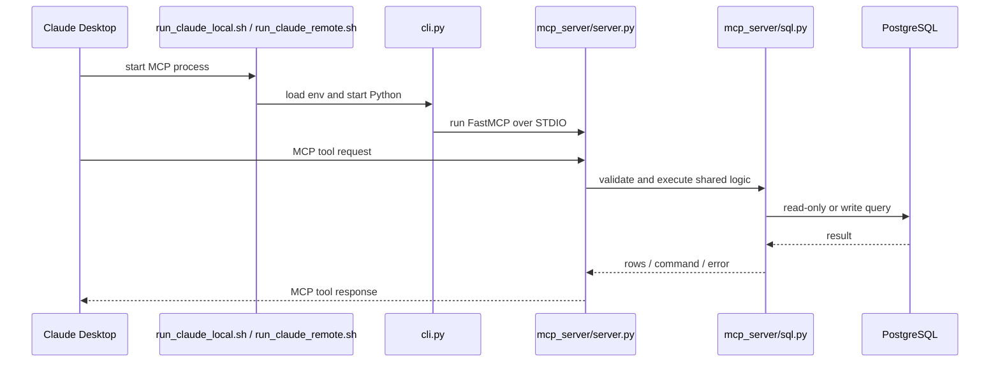
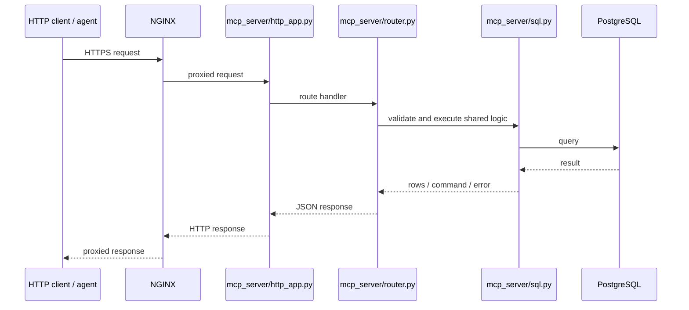
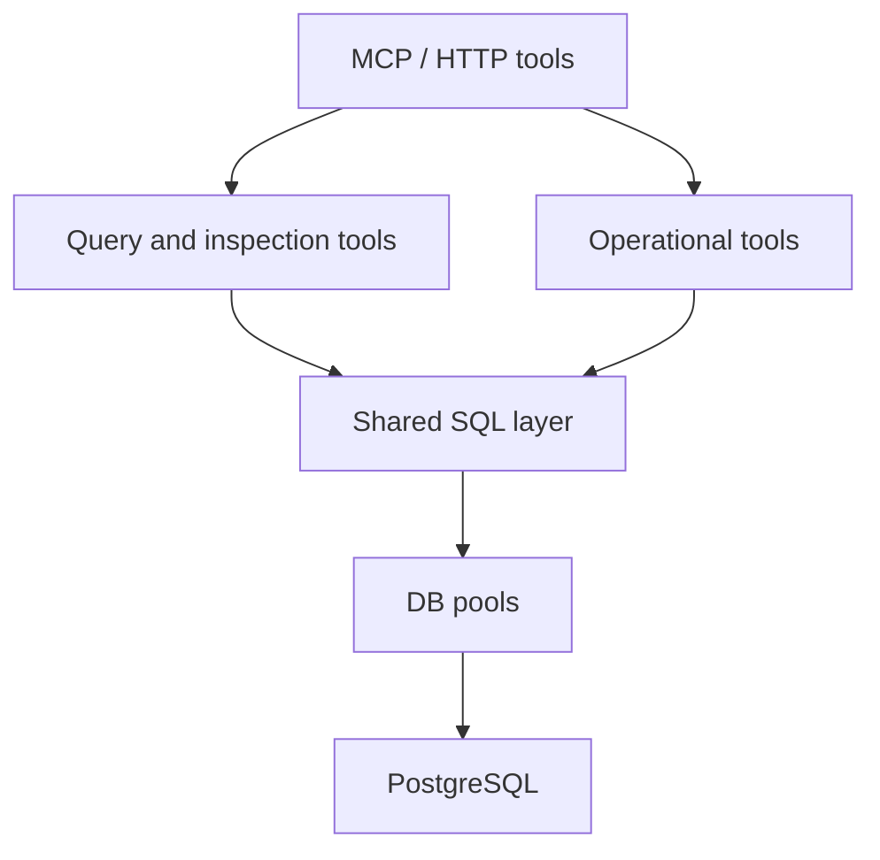
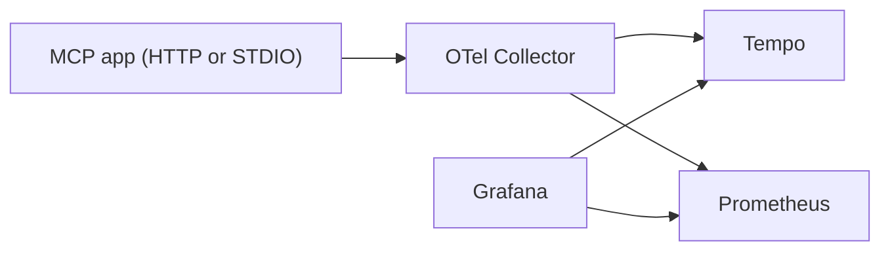
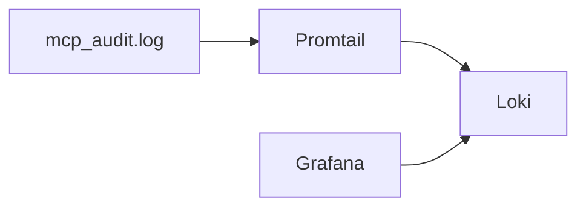
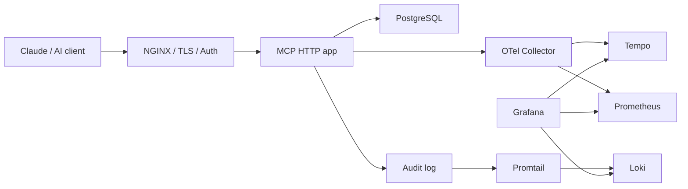

# Architecture

This document describes the current architecture of `postgres-mcp-server` as implemented in the repository today.

## 1. Purpose

The project provides controlled MCP access to PostgreSQL for Claude Desktop and other clients without directly exposing raw database credentials or unrestricted SQL execution to the client.

Primary design goals:

- least-privilege database access
- read-only query safety by default
- support for both local STDIO MCP and remote HTTP deployment
- observability with traces, metrics, and logs
- auditable tool execution

## 2. High-level architecture

## 3. Two request paths

The project supports two active transport paths.

### 3.1 Claude Desktop STDIO path

Used when Claude Desktop launches the MCP server as a local process.

Characteristics:

- no HTTP hop
- no NGINX in path
- ideal for same-machine Claude Desktop integration
- now traced with OTel spans for MCP tool invocations and nested DB spans

### 3.2 HTTP deployment path

Used when the MCP service is deployed remotely and accessed via HTTP.

Characteristics:

- correct path for multi-machine deployments
- supports NGINX, API keys, and observability tooling
- emits HTTP request spans and DB spans

## 4. Core application layers

### 4.1 Entry points

- [cli.py](/Users/ashnik/postgres-mcp-server/cli.py)
  - starts the FastMCP server over STDIO
- [mcp_server/http_app.py](/Users/ashnik/postgres-mcp-server/mcp_server/http_app.py)
  - starts the FastAPI HTTP app

### 4.2 Transport layers

- [mcp_server/server.py](/Users/ashnik/postgres-mcp-server/mcp_server/server.py)
  - MCP tool registration
  - STDIO tracing for MCP tool spans
  - audit emission for MCP path
- [mcp_server/router.py](/Users/ashnik/postgres-mcp-server/mcp_server/router.py)
  - HTTP route registration
  - request auth
  - audit emission for HTTP path

### 4.3 Shared execution layer

- [mcp_server/sql.py](/Users/ashnik/postgres-mcp-server/mcp_server/sql.py)
  - SQL normalization
  - multi-statement rejection
  - read-only enforcement helpers
  - explain-plan support
  - DB span emission
- [mcp_server/db.py](/Users/ashnik/postgres-mcp-server/mcp_server/db.py)
  - shared role-based `asyncpg` pools
  - read and write pool separation
  - pool inspection helpers

### 4.4 Governance and correlation

- [mcp_server/audit.py](/Users/ashnik/postgres-mcp-server/mcp_server/audit.py)
  - structured JSONL audit events
  - SQL preview redaction
  - query hash capture
- [mcp_server/request_context.py](/Users/ashnik/postgres-mcp-server/mcp_server/request_context.py)
  - request ID propagation for HTTP and MCP paths
- [mcp_server/otel.py](/Users/ashnik/postgres-mcp-server/mcp_server/otel.py)
  - OTel initialization and tracer access

## 5. Tool architecture

All tools are built on top of the shared SQL / pool / audit layer rather than each transport reimplementing the logic.

### 5.1 Query and inspection tools

- `health`
- `uptime`
- `schema`
- `table_stats`
- `slow_queries`
- `sql_safe`
- `sql_query`
- `explain_query`
- `index_advisor`
- `audit_logs`

### 5.2 Operational and governance tools

- `readiness`
- `config_status`
- `audit_summary`
- `access_scope`
- `pool_status`
- `locks`
- `index_usage`
- `vacuum_status`
- `replication_status`
- `redaction_test`

## 6. Database access model

The server does not bypass PostgreSQL permissions. It can only access what the configured PostgreSQL role can access.

### 6.1 Role separation

Expected DSN pattern:

- `LOCAL_READ_DATABASE_URL`
- `LOCAL_WRITE_DATABASE_URL`
- `REMOTE_READ_DATABASE_URL`
- `REMOTE_WRITE_DATABASE_URL`

Recommended roles:

- `mcp_read`
  - `CONNECT`
  - `SELECT` on approved schemas/views only
- `mcp_write`
  - narrowly scoped DML only when required

### 6.2 Read-only safety

`sql_safe` uses read-only transaction semantics in PostgreSQL so write operations fail at the database layer, not just by keyword checks.

### 6.3 Shared connection pools

The project uses cached `asyncpg` pools per role:

- read pool
- optional write pool

Benefits:

- lower connection setup latency
- better concurrency behavior
- clearer read/write isolation

## 7. Observability architecture

### 7.1 Traces

Both transport paths can emit traces:

- HTTP requests
- STDIO MCP tool calls
- nested DB spans from shared SQL execution

Path:

Relevant files:

- [deployment/otel/otel-collector.local.yaml](/Users/ashnik/postgres-mcp-server/deployment/otel/otel-collector.local.yaml)
- [deployment/otel/tempo.local.yaml](/Users/ashnik/postgres-mcp-server/deployment/otel/tempo.local.yaml)

### 7.2 Logs

Audit logs are written locally as JSON Lines and then tailed by Promtail into Loki.

Relevant files:

- [deployment/loki/loki.local.yaml](/Users/ashnik/postgres-mcp-server/deployment/loki/loki.local.yaml)
- [deployment/promtail/promtail.local.yaml](/Users/ashnik/postgres-mcp-server/deployment/promtail/promtail.local.yaml)

### 7.3 Metrics

Metrics come from:

- OTel Collector
- Tempo metrics generator
- Prometheus scraping / remote-write receiver

Relevant files:

- [deployment/prometheus/prometheus.local.yaml](/Users/ashnik/postgres-mcp-server/deployment/prometheus/prometheus.local.yaml)

### 7.4 Grafana usage model

Best operational pattern:

- dashboards for overview and trends
- `Explore -> Tempo` for deep trace debugging
- `Explore -> Loki` for audit investigation
- `Service Graph` for simple call topology

Note: the local service graph is intentionally small because the local system is mostly one traced application service, `postgres-mcp-server`.

## 8. Request correlation model

The system correlates requests across:

- HTTP responses
- MCP tool spans
- DB spans
- audit events

Main identifiers:

- `request_id`
- `trace_id`
- `span_id`

This makes it possible to:

- trace an HTTP request through the app and DB
- trace a Claude STDIO MCP invocation through the app and DB
- find the matching audit event in Loki

## 9. Deployment patterns

### 9.1 Local developer / demo setup

Single laptop or workstation:

- Claude Desktop
- local MCP process
- local PostgreSQL or remote PostgreSQL
- local Tempo / Collector / Prometheus / Loki / Grafana

Best for:

- development
- demos
- local validation

### 9.2 Distributed production-oriented setup

Best for:

- remote MCP access
- multiple machines
- NGINX enforcement
- centralized observability

Important distinction:

- STDIO is for same-machine Claude Desktop integration
- HTTP is the correct transport for cross-machine deployments

## 10. Security boundaries

### Current strengths

- read/write DSN separation
- safe read-only query tool
- no DB credentials in Claude config
- audit logging for tool activity
- API-key support for HTTP adapter

### Remaining hardening areas

- schema/table/column allow-lists
- response redaction before data leaves the server
- secret manager integration
- credential rotation without restart
- stronger multi-tenant controls

## 11. Current file map

Key files for the architecture:

- [cli.py](/Users/ashnik/postgres-mcp-server/cli.py)
- [mcp_server/server.py](/Users/ashnik/postgres-mcp-server/mcp_server/server.py)
- [mcp_server/http_app.py](/Users/ashnik/postgres-mcp-server/mcp_server/http_app.py)
- [mcp_server/router.py](/Users/ashnik/postgres-mcp-server/mcp_server/router.py)
- [mcp_server/sql.py](/Users/ashnik/postgres-mcp-server/mcp_server/sql.py)
- [mcp_server/db.py](/Users/ashnik/postgres-mcp-server/mcp_server/db.py)
- [mcp_server/audit.py](/Users/ashnik/postgres-mcp-server/mcp_server/audit.py)
- [mcp_server/otel.py](/Users/ashnik/postgres-mcp-server/mcp_server/otel.py)
- [mcp_server/request_context.py](/Users/ashnik/postgres-mcp-server/mcp_server/request_context.py)
- [mcp_server/tools/ops.py](/Users/ashnik/postgres-mcp-server/mcp_server/tools/ops.py)
- [deployment/nginx/mcp-http.conf](/Users/ashnik/postgres-mcp-server/deployment/nginx/mcp-http.conf)
- [deployment/observability/README.md](/Users/ashnik/postgres-mcp-server/deployment/observability/README.md)

## 12. Summary

The current implementation supports:

- local Claude Desktop MCP over STDIO
- remote HTTP deployment behind NGINX
- shared pooled PostgreSQL access
- structured audit logging
- distributed tracing with Tempo
- logs with Loki
- metrics with Prometheus
- Grafana dashboards and trace exploration

The project is now best described as a production-oriented MCP/PostgreSQL platform with local developer ergonomics and a clear path to a distributed HTTP deployment model.
